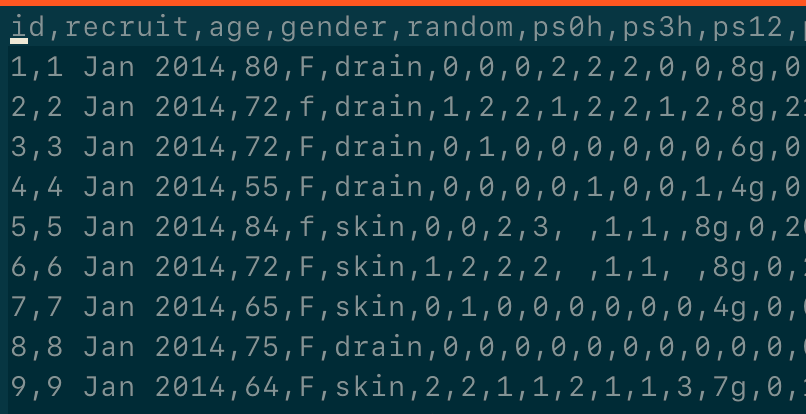
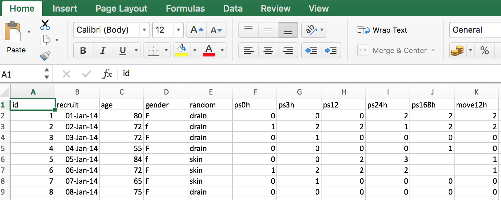
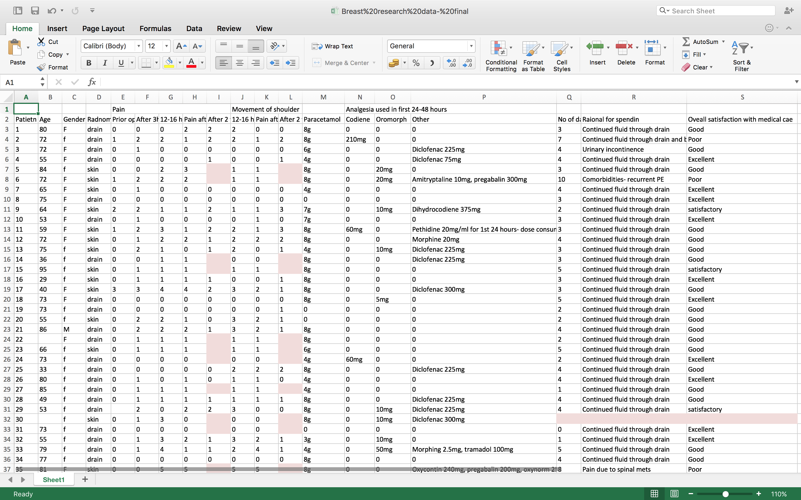

# Excel Hell

<!-- create the html version using the pandoc command below -->
<!-- pandoc -t revealjs -s --slide-level=2 -V theme=solarized 02-lesson-02-excel-hell-slide.md -o 02-lesson-02-excel-hell-slide.html -->

## Learning Objectives 

1. Learn about data types (columns)
2. Spreadsheets <> Data (Rows <> Observations)
3. Best practices for recording data
4. Common mistakes

## Outline

---

- [Data Types](#data-types)
- [Cardinal rules](#cardinal-rules)
- [Common mistakes](#common-mistakes)
- [Unravelling Data](#bad-data)
- [Exporting to CSV](#worked-example)
- [Testing your spreadsheet](#testing)

<a name="data-types"></a>

# Data types

##

> If in doubt, aim for **consistency in every column**. Never try to record more than one "type" of thing in a column.

## Integers & Decimals

- `...,-3,-2,0,1,2,3,...` versus `3.141529`
- Integers are any whole number
- Decimals include any number with a decimal point

## Strings

> A string is any sequence of characters. 

- Literally anything you can type can be represented as a string. 
- Default type in Excel
- Be careful ` 180mg ` is not a number!

## Date/Time objects

- A number as far as the computer is concerned
- Often (but not always)
    - Dates are integers counted from 1 Jan 1970
    - Times are fractions of a day
- Other possibilities
    - milliseconds since 1960
    - Days since January 0 1900 (Excel!)

## Date gotcha's


## Booleans

- `TRUE` or `FALSE` statements.
- `1` or `0` is a common shorthand

## Factors

- 'Categorical' (ordered or unordered)
- Integers with labels

## Nominal

- An **un**ordered (nominal) factor
- Named but not ordered

```
- apples
- oranges 
- pears
```

- R stores this as `1,2,3` for convenience but not because `1<2<3`.

## Ordinal

- An ordered (ordinal) factor such as a Likert scale
- Ordered and named

```
- Strongly disagree
- Disagree
- Neither agree/disagree
- Agree
- Strongly agree
```

- R stores this as `1,2,3,4,5` for convenience and understands that `1<2<3<4<5`

# Exploring Datatypes in R Studio

## Your turn ...

In R studio,

```
integers <- as.integer(c(1, 3, 15, 16))
decimals <- c(1.4, 3.5, 15.55, 16.4)
bools <- c(T, T, F, T)
dates <- as.Date(c("22/04/2016", "13/05/1997"), format = "%d/%m/%Y")
strings <- c("These are", "Strings")
factors <- as.factor(c("Apples", "Pears", "Lemons"))
factors <- as.factor(c("Good", "Better", "Best"), ordered=TRUE)
```

then use `str()` to see the data 'structure'

<a name="cardinal-rules"></a>

# Cardinal rules

<!-- - [ ] TODO(2016-05-26): need to explain the 'header row' concept -->

The cardinal rules of using spreadsheet programs for data:

## Columns

> Put all your **variables in columns** - the thing you're measuring, like 'weight', 'temperature' or 'SBP'. Break things down into their most basic constituents, and keep units in your headers only.

## Rows

> Put each **observation in its own row**. Think very carefully about what constitutes your basic observation. Often it's your patient, but it may not be as intuitive as you think.

## Headers

> Have a single 'header' row to label your columns 

## Cells

> **Don't combine multiple pieces of information in one cell**.

> **Leave the raw data raw** - don't mess with it! That means no formulas anywhere in your spreadsheet!

## Sharing

> Export the cleaned data to a **text based format** like CSV. This ensures that anyone can use the data, and is the format required by most data repositories.

# Try to think like a computer  #

## The computer doesn't care about formatting



## We do ... 


just add some white space and dividers

## And Excel ...

And all excel does is present it to us in an easy to use format.



## But ...

> But you always need to remember that you need to go back and forth between both formats.

> So merged cells, colours, comments will both be lost and confuse.


# Your turn ...

## The data

- Raw data from an RCT on pain relief following mastectomy
- Download from [Figshare](https://figshare.com/s/165cad3ce6eadbf6b19a).

## Original (dirty)



## Your mission ...

Identify and fix these common mistakes

<a name="common-mistakes"></a>

# Common mistakes

<!-- - [ ] TODO(2016-05-26): this would work nicely as a round robin teaching exercise; get each pair to read one section and teach the rest of the glass; repeat twice if needed to get through the whole list -->

##

- [Multiple tables](02-lesson-02-excel-hell.html#tables)
- [Multiple tabs](02-lesson-02-excel-hell.html#tabs)
- [Not filling in zeros](02-lesson-02-excel-hell.html#zeros)
- [Using bad null values](02-lesson-02-excel-hell.html#null)
- [Using formatting to convey information](02-lesson-02-excel-hell.html#formatting)
- [Using formatting to make the data sheet look pretty](02-lesson-02-excel-hell.html#formatting_pretty)
- [Placing comments or units in cells](02-lesson-02-excel-hell.html#units)
- [More than one piece of information in a cell](02-lesson-02-excel-hell.html#info)
- [Field name problems](02-lesson-02-excel-hell.html#field_name)
- [Special characters in data](02-lesson-02-excel-hell.html#special)
- [Inclusion of metadata in data table](02-lesson-02-excel-hell.html#metadata)
- [Date formatting]()

<a name="worked-example"></a>


# Tips

##

- 3 sheets: readme, dictionary, data ... then export,share the data sheet
- Data validation in Excel
- Learn to export to CSV


