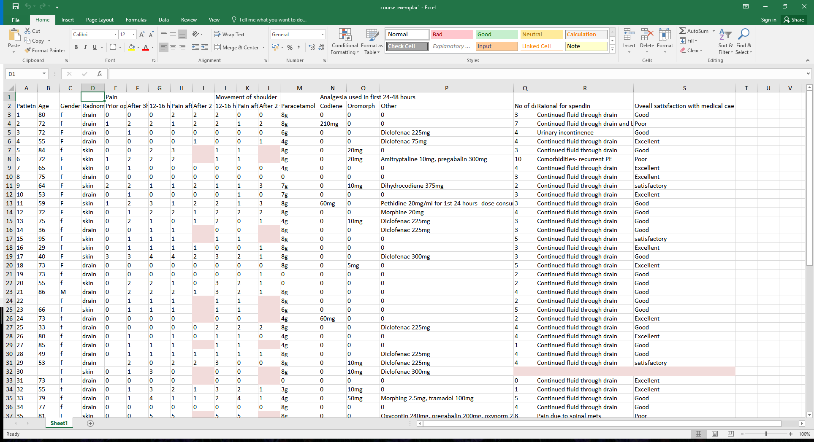
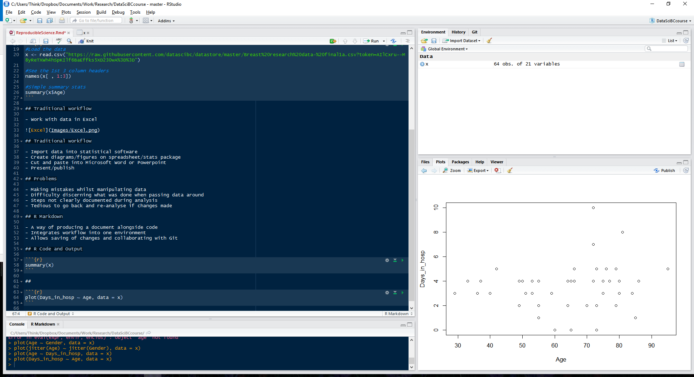
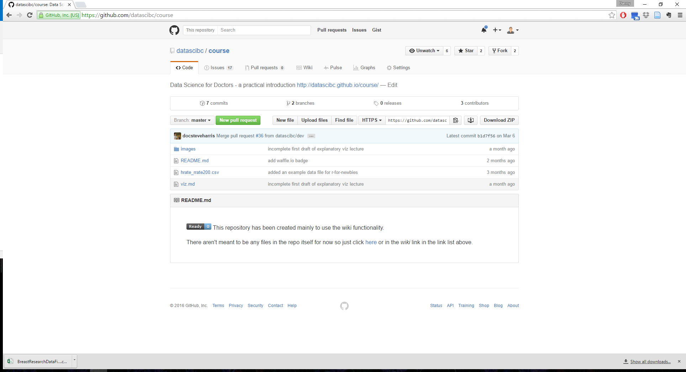
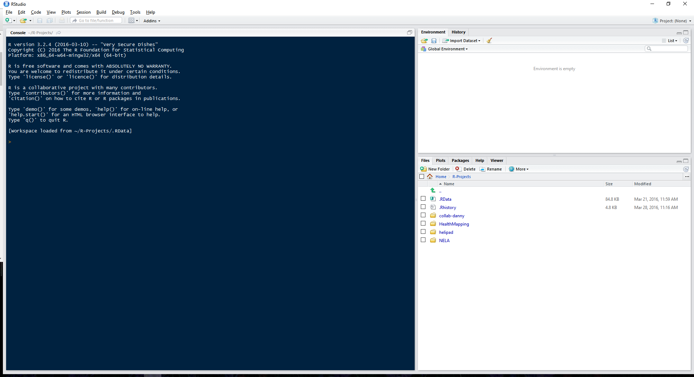

<!-- rename file with the lesson name replacing template -->

## Learning Objectives 

<!-- 
    * Reproducible science - (v1) Danny (v2) Finn 
        - [ ] back story - requirements for publications
        - [ ] teach the google sheets pipeline
        - [ ] using git in R studio??

 -->

These may be just a quick slide or two and not much for live coding

- [Comment your code]
- [GUI vs text files as your labbook]
Live coding how to update your sheet

- [Googlesheets pipeline]

If we can, introduce using Git in R??
This will need road testing.

- [R studio and git as a save procedure] 


## Lesson 

- The idea that that data analyses, and more generally, scientific claims, are published with their **data** and **software code** so that others may verify the findings and build upon them.
- When given the same starting point, you can always have the same output. So that if someone else is given the same data, they will get the same results as you.

## This involves

- Writing scripts (software code)
- Commenting within the script about what you're doing

```{r}
#Load the data
x <- read.csv("https://raw.githubusercontent.com/datascibc/datastore/master/Breast%20research%20data-%20final1a.csv?token=AIlCxru--M8yReTXWh4hSpKIlf6BaEffks5XD230wA%3D%3D")

#See the 1st 3 column headers
names(x[ , 1:3])

#Simple summary stats
summary(x$Age)
```

## Traditional workflow

- Work with data in Excel



## Traditional workflow

- Import data into statistical software
- Create diagrams/figures on spreadsheet/stats package
- Cut and paste into Microsoft Word or Powerpoint
- Present/publish

## Problems

- Making mistakes whilst manipulating data
- Difficulty discerning what was done when passing data around
- Steps not clearly documented during analysis
- Tedious to go back and re-analyse if changes made

## Benefits of Reproducible Science

- Constant documentation of steps
- Easier to collaborate and share
- Automates steps, imagine n = 1,000,000
- Allows scrutiny of steps and external validation

## R Markdown

- A way of producing a document alongside code
- Integrates workflow into one environment
- Allows saving of changes and collaborating with Git

## R Code and Output

```{r}
summary(x)
```

##

```{r}
plot(Days_in_hosp ~ Age, data = x)
```

## Going under the hood



## Github



## R Studio



## Example of Reproducible Research Document Outputs

- [Blog post](http://dannyjnwong.github.io/Helipad-Analysis/)

- [.pdf](https://www.dropbox.com/s/g4rvar9g6ybrpeb/DistanceTimeAnalysis.pdf?dl=0)

- [Microsoft Word](https://www.dropbox.com/s/8h583pps6eo47na/DistanceTimeAnalysis.docx?dl=0)


## Exercises

### Questions

### Answers


---

[Previous topic]() --- [Next topic]()


